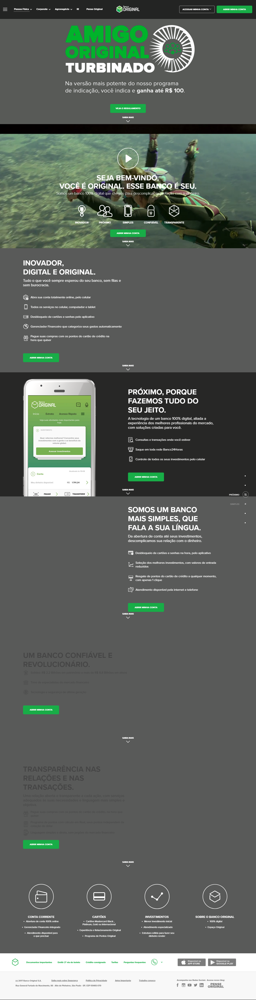
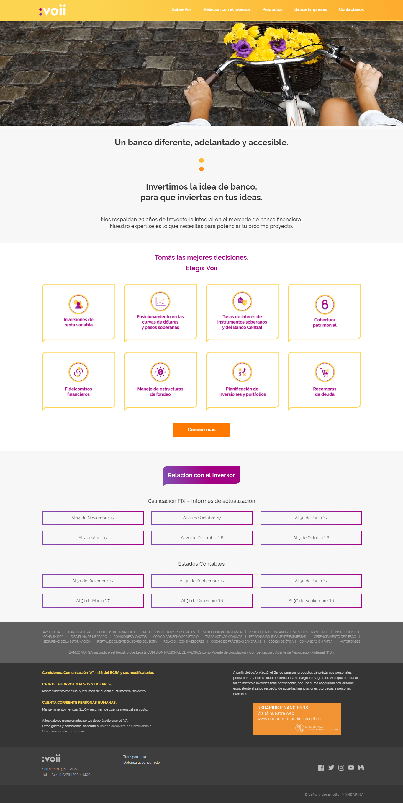

# Banco del Pais 100% Digital

Se desarrolla a solicitud del Banco del País una serie de actividades las cuales tienen como fin digitalizar los múltiples procesos en relación a sus clientes tanto en el rubro comercial como soporte postventa y consultas en general.

##### [Presentación Banco 100% Digital](https://docs.google.com/presentation/d/13S7VNRAiT_xEbgn2VpVZzeyVjvLb1Hk8kFrjRDPIVE4/edit?usp=sharing "Diapositivas")

##### [Business Model Canvas propuesto](https://docs.google.com/document/d/1T-UXTKcEXneHYgAKKy8IcOWhmIUyDL3nZNQ8zUk7QY8/edit "BMC")

##### [Trello de actividades](https://trello.com/b/FhYsVqro/reto-nueva-banco-digital-para-millenials "Trello")

###### Benchmarking

Se realiza una serie de comparaciones entre entidades financieras categorizadas como "Digitalizados para millennials" de lo cual rescatamos puntos importantes que funcionan como eje para inclinar la imagen actual del banco hacia el foco que deseamos lograr, es decir "millennials".

### ¿Cuáles son las prioridades de nuestro target?
>* Quiero ser único:
Tienen un alto sentido de individualidad.
Quieren consumir
productos y recibir servicios
completamente alineados a
sus gustos y necesidades.

>* Lo quiero digitalizado:
  Los procesos manuales, ya son cosas del pasado, la experiencia debe ser digitalizada y automatizada.

>* Lo quiero rápido y fácil:
  Tienen baja tolerancia a procesos largo y mucho peor al tiempo de espera, quieren acceso fácil e intuitivo.

>* Quiero ser único:
Tienen un alto sentido de individualidad.
Quieren consumir productos y recibir servicios completamente alineados a sus gustos y necesidades.

>* Lo quiero transparente:
  Quieren procesos claros y teer seguimiento de estos, sentirse confiados para poder recomendar dicho servicio o producto.

  ### ¿Qué es Milenibank?
  Milenibank es un banco para millennials (sí como o dice su nombre) somos una propuesta nueva para revolucionar la experiencia bancaria y venimos a borrar esas pre-ideas de que un banco es aburrido, engorroso y tedioso.

  Buscamos darle a nuestro target lo que quiere y sobre todo lo que necesita, basándonos en un profundo research y en herramientas de desarrollo, damos una experiencia transparente, segura, amigable y divertida.

  En Milenibank puedes consultar:
  * saldos y transacciones
  * transferir dinero por whatsapp así como recibir
  * acceder a promociones hechas y pensadas para ti
  * Tips para invertir tu dinero en cosas productivas
  * puedes añadir una o más cuentas, tal como instagram o facebook

  ### Dale un vistazo:
    [milenibank](https://marvelapp.com/31566a4/screen/39565769)

